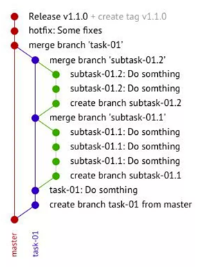
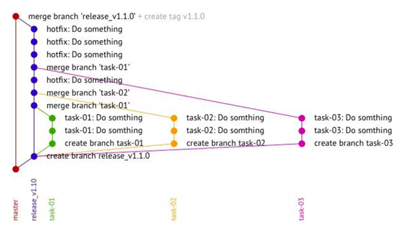

# Simple Git Flow

We have only 2 kinds of branches:

1. Feature Branch
2. Release Branch

## Common Rules

- You should do rebase from parent branch before merging
- Master branch should contain only production ready code
- You can do only this commits in master branch:
  - Merge commit for release branch
  - Bump commit. Tag with release version should be linked to this commit
  - Urgent hotfixes for production code
- You should use --no-fast-forward parameter for all merging (git merge --no-ff)
- All rebases should preserve merge commits (git rebase --preserve-merges)
- Always use --rebase parameter for pulling remote changes (git pull --rebase) to avoid merge commits for current branch
- If we have serious bug in production code we will use git revert for merge commit. If we have bump commit it should be reverted too.
- **Master branch doesn't allow force-push!**

## **Release Branch:**

- Can be created only from master branch
- Should be merged to master branch without fast forwarding after QA
- Should have actual state from master branch before merging (don't forget git rebase before merging)
- All feature branches should be merged to release branch without fast forwarding

## **Feature Branch:**

- Can be created from every branch (master branch, release branch, feature branch)
- Should be merged to parent branch when work with code and testing will be finished
- Should have actual state from parent branch before merging (don't forget fit rebase before it)

If we are planning small release which will contain only one task (it allows subtasks which will be merged to main feature branch) then Feature Branch is Release Branch. It should be created from Master Branch and will be merged to master branch without fast forwarding.

**Simple Example:**

**Advanced Example:**

## Naming Rules

- **Feature Branch** - name should be matched with issue number from Jira (ex.: TB-1234)
- **Release Branch** - name should be started from **release_v** and should contains release version (ex.: release_v3.7.0)

## Rules for Commit Comments

- **General Commit:**
  - Can be created only in Feature Branch
  - Should starts from issue number from Jira with colon and space after it
  - Text comment should starts with capital letter and should describes all changes in commit
- **Hotfix:**
  - Can be created in Release Branch and Master Branch.
  - Should starts with prefix "Hotfix: "
  - Text comment should starts with capital letter and should describes all changes in commit
- **Bump Commit:**
  - Can be created in Release Branch or Master Branch
  - Allowed onlt changes for release version (package.json or composer.json for example)
  - Should be linked with release version tag
